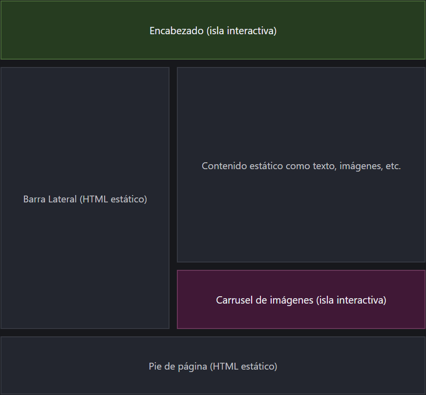

# Setup - Conceptos

Recapitularemos todo lo que vimos en la anterior página, que si no la has visto, te invito a hacerlo.

👉 [Setup - Entorno](setup-entorno.md)

Anteriormente estábamos trabajando en el punto de creación de un proyecto nuevo con la tecnología de Astro y que empezamos a crear nuestro proyecto usando `npm` , para instalar nuestros paquetes y aprendimos a configurar correctamente nuestro proyecto evaluando el caso que estuviéramos trabajando, en esta guía vamos a continuar lo que dejamos pendiente, vamos a ello.

### 🚀 Conceptos básicos sobre Astro

#### 🌟 ¿Por qué Astro?

Si no sabes que es Astro te invito a leer está sección 👉 [Astro](setup-entorno.md#que-es-astro).

> Se orienta a sitios web con contenido, como blogs, marketing y comercio electrónico, Astro es pionero de la nueva arquitectura de frontend, con el objetivo de reducir la sobrecarga y complejidad de JavaScript en comparación con otros frameworks o librerías, si necesitas rapidez y eficiencia, Astro es el ideal.

#### 🚀 Características

Astro es un framework todo en uno, incluye todo lo que necesitas para crear un sitio web, integrando otros frameworks sin problemas, cómo React, Angular, Vue, entre otros. Así como Adaptadores y otras integraciones como Bases de Datos, Autenticación y más, veamos algunos aspectos de Astro:

<details>

<summary>Islas o Server Islands</summary>

Una arquitectura web basada en componentes optimizada para sitios web orientados al contenido.

</details>

<details>

<summary>Agnóstico de la UI</summary>

Compatible con React, Preact, Svelte, Vue, Solid, HTMX, web components y más.

</details>

<details>

<summary>Servidor primero</summary>

Mueve la renderización costosa fuera de los dispositivos de tus visitantes.

</details>

<details>

<summary>Cero JS por defecto</summary>

Menos JavaScript del lado del cliente para ralentizar tu sitio.

</details>

<details>

<summary>Colecciones de contenido (opcional)</summary>

Organiza, valida y proporciona seguridad de tipos de TypeScript para tu contenido Markdown.

</details>

<details>

<summary>Personalizable (opcional)</summary>

Partydown, MDX y cientos de integraciones que eleguir.

</details>

> Astro ayudó a promover y popularizar un nuevo patrón de arquitectura de frontend llamado **Arquitectura de islas.**

### 🏝️ Arquitectura de Islas

Imagina un sitio web como una gran isla llena de vida. Ahora piensa: ¿realmente todo lo que ves en una página necesita estar "vivo" o en movimiento con JavaScript?

La arquitectura de islas que propone Astro dice no todo. En vez de convertir toda la página en una aplicación JavaScript gigante (como hacen otros frameworks), Astro crea un enfoque más inteligente:



#### 🌊 ¿Cómo funcionan?

Astro renderiza la mayor parte de tu sitio como HTML estático. Esto significa que carga más rápido, es más eficiente y es ideal para contenido como textos, imágenes, encabezados o pies de página.

> Pero... ¿Qué pasa con los componentes interactivos como un botón que abre un menú o un carrito de compras?

Esos elementos se convierten en "_islas interactivas_": pequeñas porciones que sí usan JavaScript, solo cuando y donde hace falta.



#### 🧠 ¿Por qué es útil?

> ✅ **Rendimiento**: Al enviar menos JavaScript al navegador, tu sitio carga más rápido.
>
> ✅ **Escalabilidad**: Podéis usar componentes de otros frameworks (como Vue, React o Svelte) solo donde lo necesites.
>
> ✅ **Optimización**: Astro se encarga de inyectar el JavaScript mínimo indispensable.

Podemos ver un ejemplo de lo que quiere Astro para que tengamos una idea:

<figure><figcaption></figcaption></figure>

Cómo podemos ver tenemos un encabezado, una barra lateral, un recuadro para texto o imágenes y un pie de página, si nos fijamos todo es estático.

> Sé que te estarás preguntando, pero no omitiste algo más? El carrusel de imágenes lo sé, pero si nos percatamos y analizamos es un componente interactivo y dinámico.

Si analizamos a nivel general, nos percatamos que mantenemos el principio de Astro e integramos un componente interactivo, solo si se requiere y se pudo haber con cualquier framework o librería.

> Es como tener un sitio 95% estático... con un 5% de magia ✨



### 🌍 Renderizado híbrido en Astro

> En el desarrollo web existen, tipos de renderizado cómo SPA, SSG, SSR y ISSR.

Astro no te obliga a elegir un solo tipo de renderización. Podéis usar varios en el mismo proyecto, dependiendo de cada página o componente. Esto lo hace muy flexible y poderoso.

#### 📦 ¿Qué tipo de renderizado soporta Astro?

| Tipo de renderizado                       | Soportado por Astro | Explicación                                                                                                        |
| ----------------------------------------- | ------------------- | ------------------------------------------------------------------------------------------------------------------ |
| **SSG** (Static Site Generation)          | ✅ Soportado         | Astro genera archivos HTML estáticos durante el build. Ideal para contenido que no cambia seguido.                 |
| **SSR** (Server Side Rendering)           | ✅ Soportado         | La página se genera en el servidor cada vez que alguien la solicita. Útil para contenido dinámico o personalizado. |
| **ISR** (Incremental Static Regeneration) | ⚠ Parcialmente      | No lo soporta "oficialmente", pero podéis lograrlo usando SSR + caché/control en el servidor.                      |
| **SPA** (Single Page Application)         | 🆘 No directamente  | Astro no genera SPA, **pero podéis integrar un framework para manejar partes del sitio.**                          |

#### 🆘 ¿Y entonces cómo manejo un SPA dentro de Astro?

Astro **no está diseñado para ser un framework SPA completo**, como lo son Vue, React o Angular. Su filosofía es **usar solo JavaScript donde realmente hace falta**, y eso es una ventaja.

Sin embargo, **podéis tener "secciones SPA" o "mini apps" dentro del proyecto** usando frameworks UI.

> 🔧 ¿Cómo hacerlo?
>
> 1. Integrar un framework al ecosistema de Astro.
> 2. Creas un componente que maneje la lógica de SPA.
> 3. Lo montas dentro un archivo `.astro`  con `client:only`, `client:load`, `client:visible` .
>
> 🤑 Ejemplo
>
> ```html
> ---
> import CarruselImágenes from '../components/CarruselImágenes.vue';
> ---
>
> <CarruselImágenes client:only="vue" />
> ```
>
> Con eso, **le estás diciendo a Astro que ese componente se comporta como una SPA embebida**.
>
> > 🌟 **Truco**: si toda una sección del sitio debe funcionar como SPA (por ejemplo, un dashboard administrativo), podéis tener una página `.astro` que cargue esa app Vue/React, y el resto del sitio sigue siendo estático o SSR.

Sé que te estarás preguntando, ¿Por qué nos desviamos tanto de Setup? Tranquilo, a continuación retomaremos donde quedamos en la página anterior, en la próxima página nos adentraremos a la estructura de archivos de Astro.
